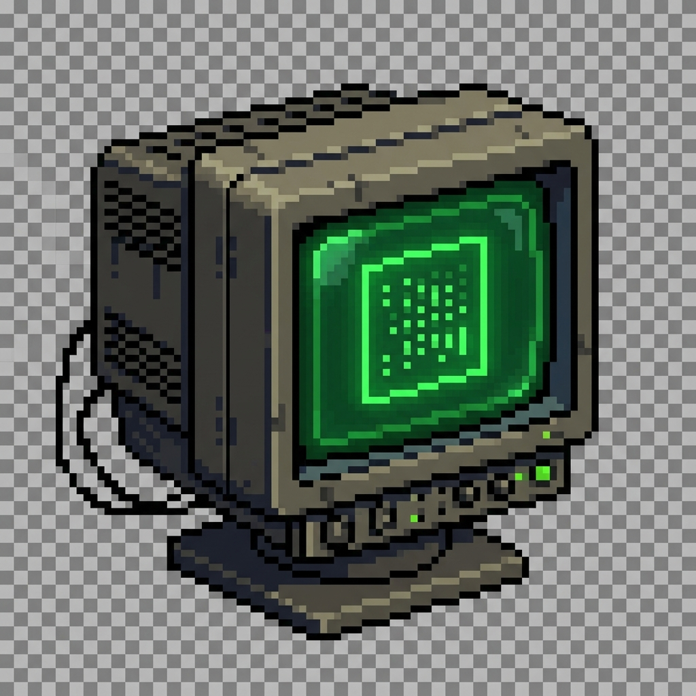

# Skufia-Net Cyber Platform



Кибер-платформа 90-х с E2EE чатом, форумом и базой знаний. Современные технологии в эстетике индустриального киберпанка.

## 🚀 Быстрый старт

Для запуска всей экосистемы (Backend, Frontend, Redis, Postgres, Celery, Coturn) выполните:

```bash
docker-compose up -d
```

После запуска:
- **Frontend**: [http://localhost:8008](http://localhost:8008) (или [http://localhost:5551](http://localhost:5551) в зависимости от конфигурации)
- **API Documentation**: [http://localhost:8007/docs](http://localhost:8007/docs)

## 🛠 Технический стек

### Backend
- **FastAPI**: Современный, быстрый веб-фреймворк для создания API.
- **SQLAlchemy**: Мощная ORM для работы с PostgreSQL.
- **Redis**: Хранилище сессий, кэширование и брокер сообщений для WebSocket.
- **Celery**: Фоновые задачи (обработка медиа, рассылка уведомлений).

### Frontend
- **Vanilla JS**: Чистый JavaScript без тяжелых фреймворков для максимальной скорости.
- **WebCrypto API**: Сквозное шифрование на стороне клиента.
- **IndexedDB**: Локальное хранилище для оффлайн-работы и безопасного хранения ключей.

## 📡 API

Документация API доступна по адресу `/docs`. Все мутирующие запросы требуют заголовок `X-Idempotency-Key` для обеспечения надежности при нестабильном соединении.

## 🔒 Безопасность (E2EE)

Skufia-Net использует архитектуру **Zero-Knowledge**. Сервер никогда не видит ваши личные сообщения в открытом виде.

- **Identity Keys**: RSA-4096 пары, генерируемые в браузере. Приватный ключ шифруется паролем пользователя перед сохранением в облаке (опционально) или хранится локально в IndexedDB.
- **Session Keys**: AES-256-GCM ключи для каждой комнаты.
- **Key Exchange**: Использование RSA-OAEP для безопасной передачи сессионных ключей участникам чата.
- **Forward Secrecy**: Поддержка ротации ключей и версионирования бандлов ключей (`key_version`).

## 📚 Документация

Подробности архитектуры и планы развития можно найти в директории `docs/`:
- [Architecture & Mind Map](docs/ARCHITECTURE.md)
- [Roadmap](docs/ROADMAP.md)

---
*Powered by Skufia Engineering Team*
